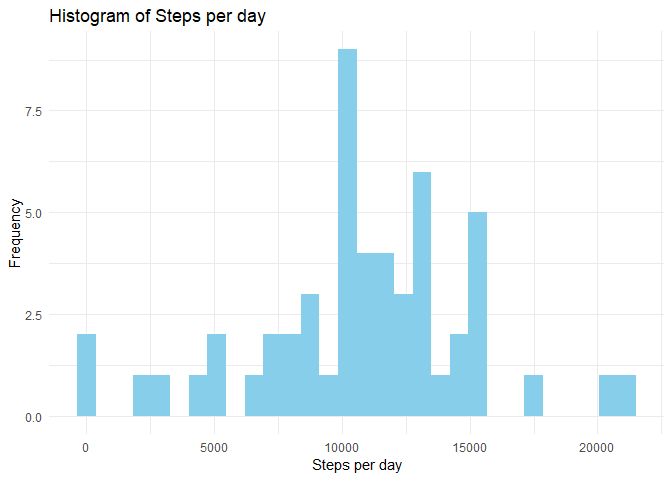
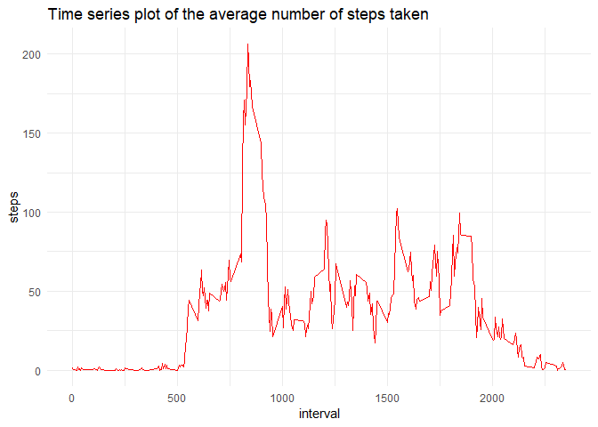
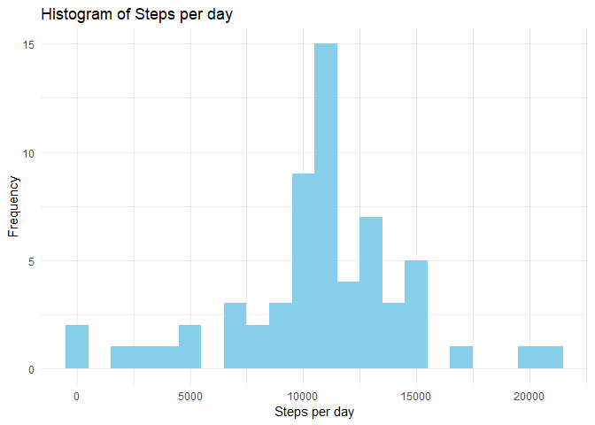
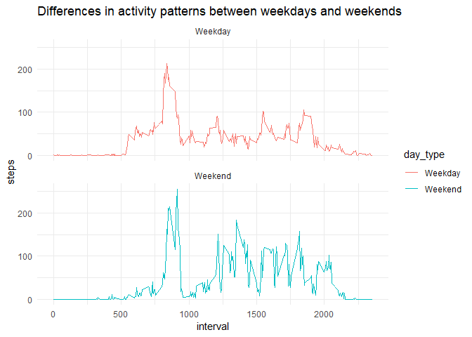

### By :- vimal kushwaha 


## Introduction
This assignment makes use of data from a personal activity monitoring device. This device collects data at 5 minute intervals throughout the day. The data consists of two months of data from an anonymous individual collected during the months of October and November, 2012 and include the number of steps taken in 5 minute intervals each day.

This document presents the results from Project Assignment 1 in the Coursera course Reproducible Research, written in a single R markdown document that can be processed by knitr and transformed into an HTML file.

## Load all the necessary packages

```r
library(tidyverse)
```

```
## Warning: package 'tidyverse' was built under R version 3.4.4
```

```
## -- Attaching packages ------------------------------------------- tidyverse 1.2.1 --
```

```
## v ggplot2 3.1.1       v purrr   0.3.2  
## v tibble  2.1.1       v dplyr   0.8.0.1
## v tidyr   0.8.3       v stringr 1.4.0  
## v readr   1.3.1       v forcats 0.4.0
```

```
## Warning: package 'ggplot2' was built under R version 3.4.4
```

```
## Warning: package 'tibble' was built under R version 3.4.4
```

```
## Warning: package 'tidyr' was built under R version 3.4.4
```

```
## Warning: package 'readr' was built under R version 3.4.4
```

```
## Warning: package 'purrr' was built under R version 3.4.4
```

```
## Warning: package 'dplyr' was built under R version 3.4.4
```

```
## Warning: package 'stringr' was built under R version 3.4.4
```

```
## Warning: package 'forcats' was built under R version 3.4.4
```

```
## -- Conflicts ---------------------------------------------- tidyverse_conflicts() --
## x dplyr::filter() masks stats::filter()
## x dplyr::lag()    masks stats::lag()
```

```r
library(dplyr)
```

## Importing the data

```r
dataset=read_csv('activity.csv')
```

```
## Parsed with column specification:
## cols(
##   steps = col_double(),
##   date = col_date(format = ""),
##   interval = col_double()
## )
```

```r
data<-dataset
```

## Removing "NA" values from the dataset

```r
data=na.omit(data)
glimpse(data)
```

```
## Observations: 15,264
## Variables: 3
## $ steps    <dbl> 0, 0, 0, 0, 0, 0, 0, 0, 0, 0, 0, 0, 0, 0, 0, 0, 0, 0,...
## $ date     <date> 2012-10-02, 2012-10-02, 2012-10-02, 2012-10-02, 2012...
## $ interval <dbl> 0, 5, 10, 15, 20, 25, 30, 35, 40, 45, 50, 55, 100, 10...
```

```r
summary(data)
```

```
##      steps             date               interval     
##  Min.   :  0.00   Min.   :2012-10-02   Min.   :   0.0  
##  1st Qu.:  0.00   1st Qu.:2012-10-16   1st Qu.: 588.8  
##  Median :  0.00   Median :2012-10-29   Median :1177.5  
##  Mean   : 37.38   Mean   :2012-10-30   Mean   :1177.5  
##  3rd Qu.: 12.00   3rd Qu.:2012-11-16   3rd Qu.:1766.2  
##  Max.   :806.00   Max.   :2012-11-29   Max.   :2355.0
```

## What is mean total number of steps taken per day?
For this part of the assignment, you can ignore the missing values in the dataset.

    1.Calculate the total number of steps taken per day.
    
    2.If you do not understand the difference between a histogram and a barplot,research the difference between them.Make a histogram of the total number of steps taken each day.
    
    3.Calculate and report the mean and median of the total number of steps taken per day.


```r
steps_per_day<-data%>%
               group_by(date)%>%
               summarise(total=sum(steps))
head(steps_per_day)
```

```
## # A tibble: 6 x 2
##   date       total
##   <date>     <dbl>
## 1 2012-10-02   126
## 2 2012-10-03 11352
## 3 2012-10-04 12116
## 4 2012-10-05 13294
## 5 2012-10-06 15420
## 6 2012-10-07 11015
```

```r
theme_set(theme_minimal())
#Histogram of the total number of steps taken each day
ggplot(steps_per_day,aes(total,binwidth=1000))+
geom_histogram(fill='sky blue')+  
labs(title = "Histogram of Steps per day", x = "Steps per day", y = "Frequency")
```

```
## `stat_bin()` using `bins = 30`. Pick better value with `binwidth`.
```

<!-- -->

```r
#Mean and median number of steps taken each day
mean_steps_per_day<-mean(steps_per_day$total)
median_steps_per_day<-median(steps_per_day$total)
print(mean_steps_per_day)
```

```
## [1] 10766.19
```

```r
print(median_steps_per_day)
```

```
## [1] 10765
```

# What is the average daily activity pattern?
    1.Make a time series plot (i.e. \color{red}{\verb|type = "l"|}type="l") of the 5-minute interval (x-axis) and the average number of steps taken, averaged across all days (y-axis)
    
    2.Which 5-minute interval, on average across all the days in the dataset, contains the maximum number of steps?
    

```r
#The 5-minute interval that, on average, contains the maximum number of steps
time_series <- data %>%
  group_by(interval) %>%
  summarise(steps = mean(steps))

ggplot(time_series,aes(x=interval,y=steps))+
geom_line(color='red')+
labs(title='Time series plot of the average number of steps taken')
```

<!-- -->

```r
#The 5-minute interval that, on average, contains the maximum number of steps
group_by_interval<-time_series%>%
                   filter(steps==max(steps))
print(group_by_interval)
```

```
## # A tibble: 1 x 2
##   interval steps
##      <dbl> <dbl>
## 1      835  206.
```

# Imputing missing values
Note that there are a number of days/intervals where there are missing values (coded as \color{red}{\verb|NA|}NA). The presence of missing days may introduce bias into some calculations or summaries of the data.

    1.Calculate and report the total number of missing values in the dataset (i.e. the total number of rows with \color{red}{\verb|NA|}NAs)
    
    2.Devise a strategy for filling in all of the missing values in the dataset. The strategy does not need to be sophisticated. For example, you could use the mean/median for that day, or the mean for that 5-minute interval, etc.
    
    3.Create a new dataset that is equal to the original dataset but with the missing data filled in.
    
    4.Make a histogram of the total number of steps taken each day and Calculate and report the mean and median total number of steps taken per day. Do these values differ from the estimates from the first part of the assignment? What is the impact of imputing missing data on the estimates of the total daily number of steps?


```r
#Code to describe and show a strategy for imputing missing data

#number of na values  
na_values<-is.na(dataset$steps)

#Imputing Missing values
mean_intv <- tapply(dataset$steps, dataset$interval, mean, na.rm=TRUE, simplify=TRUE)
dataset$steps[na_values]<-mean_intv[as.character(dataset$interval[na_values])]
summary(dataset)
```

```
##      steps             date               interval     
##  Min.   :  0.00   Min.   :2012-10-01   Min.   :   0.0  
##  1st Qu.:  0.00   1st Qu.:2012-10-16   1st Qu.: 588.8  
##  Median :  0.00   Median :2012-10-31   Median :1177.5  
##  Mean   : 37.38   Mean   :2012-10-31   Mean   :1177.5  
##  3rd Qu.: 27.00   3rd Qu.:2012-11-15   3rd Qu.:1766.2  
##  Max.   :806.00   Max.   :2012-11-30   Max.   :2355.0
```

```r
#Calculating total number of steps taken each day
steps_per_day<-dataset%>%
               group_by(date)%>%
               summarise(total=sum(steps))%>%
               print
```

```
## # A tibble: 61 x 2
##    date        total
##    <date>      <dbl>
##  1 2012-10-01 10766.
##  2 2012-10-02   126 
##  3 2012-10-03 11352 
##  4 2012-10-04 12116 
##  5 2012-10-05 13294 
##  6 2012-10-06 15420 
##  7 2012-10-07 11015 
##  8 2012-10-08 10766.
##  9 2012-10-09 12811 
## 10 2012-10-10  9900 
## # ... with 51 more rows
```

```r
head(steps_per_day)
```

```
## # A tibble: 6 x 2
##   date        total
##   <date>      <dbl>
## 1 2012-10-01 10766.
## 2 2012-10-02   126 
## 3 2012-10-03 11352 
## 4 2012-10-04 12116 
## 5 2012-10-05 13294 
## 6 2012-10-06 15420
```

```r
theme_set(theme_minimal())


#Histogram of the total number of steps taken each day
ggplot(steps_per_day,aes(total))+
geom_histogram(fill='sky blue',binwidth=1000)+  
labs(title = "Histogram of Steps per day", x = "Steps per day", y = "Frequency")
```

<!-- -->

```r
#Calculating total number of steps taken each day
steps_per_day<-dataset%>%
               group_by(date)%>%
               summarise(total=sum(steps))%>%
               print
```

```
## # A tibble: 61 x 2
##    date        total
##    <date>      <dbl>
##  1 2012-10-01 10766.
##  2 2012-10-02   126 
##  3 2012-10-03 11352 
##  4 2012-10-04 12116 
##  5 2012-10-05 13294 
##  6 2012-10-06 15420 
##  7 2012-10-07 11015 
##  8 2012-10-08 10766.
##  9 2012-10-09 12811 
## 10 2012-10-10  9900 
## # ... with 51 more rows
```

```r
head(steps_per_day)
```

```
## # A tibble: 6 x 2
##   date        total
##   <date>      <dbl>
## 1 2012-10-01 10766.
## 2 2012-10-02   126 
## 3 2012-10-03 11352 
## 4 2012-10-04 12116 
## 5 2012-10-05 13294 
## 6 2012-10-06 15420
```

```r
theme_set(theme_minimal())
#Histogram of the total number of steps taken each day
ggplot(steps_per_day,aes(total))+
geom_histogram(fill='sky blue',binwidth=1000)+  
labs(title = "Histogram of Steps per day", x = "Steps per day", y = "Frequency")
```

<!-- -->

# Are there differences in activity patterns between weekdays and weekends?
For this part the \color{red}{\verb|weekdays()|}weekdays() function may be of some help here. Use the dataset with the filled-in missing values for this part.

    1.Create a new factor variable in the dataset with two levels – “weekday” and “weekend” indicating whether a given date is a weekday or weekend day.
    
    2.Make a panel plot containing a time series plot (i.e. \color{red}{\verb|type = "l"|}type="l") of the 5-minute interval (x-axis) and the average number of steps taken, averaged across all weekday days or weekend days (y-axis). See the README file in the GitHub repository to see an example of what this plot should look like using simulated data.
    

```r
#Create a new factor variable in the dataset with two levels – “weekday” and “weekend”
dataset<-dataset%>%
         mutate(day_type=case_when(
             (weekdays(date)=='Saturday')|(weekdays(date)=='Saturday') ~ 'Weekend',
             TRUE ~'Weekday'))


#Time series plot for 'weekday' & 'weekend'
t_series <- dataset %>%
  group_by(day_type,interval) %>%
  summarize(steps = mean(steps))


ggplot(t_series,aes(x=interval,y=steps,color=day_type))+
geom_line()+
labs(title="Differences in activity patterns between weekdays and weekends")+
facet_wrap(~day_type,nrow=2)
```

<!-- -->
